# Technical Documentation

## Project
War for Power

## Author
Leonid Polechshuk

## Type of work
Individual semester project

## 1. Project Overview

War for Power is a turn-based strategy game developed in Java using JavaFX. Players recruit units, move across a hexagonal map, capture territory, fight battles and earn income from controlled bases. The game combines territorial expansion, terrain-based unit advantages and end-game score evaluation.

The goal of the project is to design and implement a structured Java application with clear object-oriented architecture. The application is divided into model, view and controller layers, while several additional subsystems are prepared for battles, score calculation, saving, logging and turn timing.

## 2. Architecture Overview

The application is structured into several main layers and subsystems:

- **Model** – contains the main game rules, game state, map structure, units, players, tile hierarchy, battle resolution and score calculation.
- **View** – contains JavaFX components used to render the menu, map, top panel, battle screen, purchase menu, end-game screen and visual map overlays.
- **Controller** – connects user interaction with the model and updates visible application state.
- **Supporting infrastructure** – contains timer, saving and logging related components.

The central coordinating class is `Game`, which manages turn order, round progression, recruitment, movement, capturing, elimination and end-game flow. Additional logic is delegated to dedicated subsystems such as `BattleResolver` and `ScoreCalculator`.

## 3. Main Classes and Responsibilities

### 3.1 Core game logic

- **Game**  
  Central class coordinating turn flow, round progression, recruitment, movement, capturing, player elimination and end-game triggering.

- **GameMap**  
  Stores the map structure and all tiles. Provides tile access, neighbour lookup and map-related queries.

- **Player**  
  Represents one player in the game. Stores player identity, color, money, number of bases and elimination state.

- **Unit**  
  Represents one unit controlled by a player. Stores unit type, owner, occupied tile and round-based main action state.

- **UnitType**  
  Enumeration defining unit types, terrain advantage, terrain disadvantage and recruitment price.

### 3.2 Tile model

- **HexTile**  
  Abstract base class for all map tiles.

- **OccupiableTile**  
  Abstract tile type that may contain units.

- **TerrainTile**  
  Standard terrain tile that is occupiable and ownable. Each terrain tile has a `TerrainType`, which can be:
    - `FOREST`
    - `PLAINS`
    - `MOUNTAIN`
    - `DESERT`

  Terrain type is used in battle logic, because units have terrain advantages and disadvantages.

- **BaseTile**  
  Special occupiable and ownable tile used for recruitment and income generation.

- **CityTile**  
  Special tile representing a neutral city. Cannot be occupied by units directly — conquered by adjacent attack.

- **Ownable**  
  Interface implemented by capturable tiles.

- **HexTileCoords**  
  Value object representing coordinates of one tile on the hexagonal map.

### 3.3 Battle subsystem

- **BattleResolver**  
  Resolves battle outcomes between attacking and defending sides.

- **BattleResult**  
  Stores complete resolved battle data for both logic and presentation.

- **BattleSideResult**  
  Stores battle data of one side, including participating units, dice result, bonus points and lost units.

- **BattleOutcome**  
  Enumeration representing attacker win, defender win or draw.

- **Dice / DiceRoll**  
  Supporting classes for battle dice generation and representation.

### 3.4 Score subsystem

- **ScoreCalculator**  
  Calculates final score of all players.

- **ScoreResult**  
  Stores final score components of one player.

- **GameScoreResult**  
  Stores all score results and the list of winners.

### 3.5 Controller and view layer

- **GameController**  
  Connects the game model with visual components and user interaction.

- **SceneManager**  
  Handles switching between major application scenes.

- **MenuView**  
  Main menu screen.

- **GameView**  
  Main in-game container view.

- **GameMapView**  
  Renders map tiles and highlights.

- **UnitLayerView**  
  Renders units on top of the map.

- **TileOwnershipLayerView**  
  Renders ownership markers such as flags.

- **GameTopPanelView**  
  Displays current player, round, money and turn controls.

- **UnitPurchaseMenuView**  
  Contextual menu for unit recruitment on bases.

- **BattleView**  
  Planned component for presenting resolved battles.

- **EndGameView**  
  End-game screen showing winners and score summary.

- **TurnTimerView**  
  Visual component showing remaining turn time.

### 3.6 Supporting components

- **TurnTimerService**  
  JavaFX background service used for counting down turn time.

- **SaveManager**  
  Prepared subsystem for saving and loading game state.

- **LoggingConfig**  
  Configures application-wide logging.

## 4. Relationships Between Classes

The class relationships follow a layered object-oriented structure.

- `Game` aggregates the main game state and works with `GameMap`, `Player[]` and `ScoreCalculator`.
- `GameMap` stores the tile structure of the game and manages access to `HexTile` objects and their subclasses.
- `OccupiableTile` extends `HexTile` and is specialized by `TerrainTile`, `BaseTile` and `CityTile`.
- `TerrainTile` and `BaseTile` implement the `Ownable` interface.
- `Unit` is associated with `Player`, `UnitType` and the currently occupied `OccupiableTile`.
- `BattleResolver` creates `BattleResult`, which contains two `BattleSideResult` objects and one `BattleOutcome`.
- `ScoreCalculator` creates `GameScoreResult`, which contains `ScoreResult` objects.
- `GameController` connects `Game` with JavaFX views.
- `GameView` combines map-related and HUD-related visual components.
- `SceneManager` switches between major application scenes such as menu, active game and end-game screen.

## 5. Simplified UML Class Diagram

The following diagram shows the simplified object design of the application and the most important relationships between classes.

## 6. Game and Application States

The application can be divided into several main states.

### 6.1 Application states

- **Main menu**  
  Initial application state. The player can start a new game, load a saved game(planned) or exit the application.

- **Active game**  
  Main gameplay state. The player interacts with the map, recruits units, moves units, captures tiles and ends turns.

- **Battle presentation**  
  Temporary state used to display resolved battle results in a dedicated battle view. The turn timer may be paused during this state.

- **End-game screen**  
  Final state shown after the game ends. It displays winners and final score summary.

### 6.2 In-game states

During the active game, the following gameplay states may occur:

- **New game initialization**  
  The map is generated, players are initialized and the first player is selected.

- **Current player's turn**  
  The active player may perform allowed actions according to current game rules.

- **Base interaction / purchase menu**  
  The player selects a base and opens the unit recruitment menu.

- **Unit selection**  
  A unit is selected and possible movement options are evaluated.

- **Movement resolution**  
  A valid target tile is selected and the unit is moved.

- **Tile capture**  
  A unit standing on a capturable tile may capture it if the player has enough money.

- **Battle resolution**  
  Battle logic is resolved in the model and then presented visually.

- **Turn end**  
  The game switches to the next active player.

- **Round end**  
  Temporary round-based states are reset and base income is awarded.

- **Player elimination**  
  A player is eliminated after losing all bases and units.

- **Game over**  
  The game ends either when only one active player remains or when the maximum number of rounds is reached.

## 7. Technologies Used

The project uses the following technologies and tools:

- **Java 21** – main programming language
- **Maven** – project build and dependency management
- **JavaFX** – graphical user interface
- **JavaFX Service / Task API** – background timer functionality
- **java.util.logging** – application logging
- **Git / GitLab** – version control and project progress tracking

## 8. Additional Architectural Components

Several supporting subsystems are already prepared in the architecture:

- **Logging**  
  Application-wide logging is configured through `LoggingConfig`. Logging can be enabled by startup parameter in the launcher.

- **Saving and loading**  
  `SaveManager` is prepared as a dedicated subsystem for saving and loading game state.

- **Turn timer**  
  `TurnTimerService` is prepared as a JavaFX background service for turn countdown. The timer may be paused during temporary states such as battle presentation.

These components are already represented in the project structure and will be completed in later implementation stages.

## 9. Team Work Split

The project is developed individually.

## 10. Conclusion

At the CP2 stage, the main object-oriented structure of the application is already defined. The core model, tile hierarchy, battle subsystem, score subsystem, controller layer and essential view components are prepared as a stable architectural skeleton. Further work will primarily focus on completing the implementation of already prepared classes.