# Technical Documentation

## Project
War for Power

## Author
Leonid Polechshuk

## Type of work
Individual semester project

## 1. Project Overview

War for Power is a turn-based strategy game developed in Java using JavaFX. Players recruit units, move across a hexagonal map, capture territory, fight battles and earn income from controlled bases. The game combines territorial expansion, terrain-based unit advantages and end-game score evaluation.

The application is divided into model, view and controller layers, with several additional subsystems handling battles, score calculation, saving, logging and turn timing. The central coordinating class is `Game`, which manages turn order, round progression, recruitment, movement, capturing, player elimination and end-game flow.

## 2. Architecture Overview

The application is structured into the following main layers:

- **Model** – contains the main game rules, game state, map structure, units, players, tile hierarchy, battle resolution and score calculation.
- **View** – contains JavaFX components used to render the menu, map, top panel, battle overlay, purchase menu, end-game screen and visual map overlays.
- **Controller** – connects user interaction with the model and updates visible application state.
- **Save** – contains DTO snapshot records and SaveManager for JSON-based game persistence.
- **Logging** – configures application-wide logging through SLF4J and Logback.

## 3. Main Classes and Responsibilities

### 3.1 Core game logic

- **Game**  
  Central class coordinating turn flow, round progression, recruitment, movement, capturing, battle resolution, player elimination and end-game triggering. Exposes methods for resolving and applying battle results and for restoring game state from a saved snapshot.

- **GameMap**  
  Stores the map structure and all tiles. Provides tile access, neighbour lookup, map generation, tile replacement and map restoration from snapshot.

- **Player**  
  Represents one player. Stores identity, color, money, base count and elimination state.

- **Unit**  
  Represents one unit controlled by a player. Stores unit type, owner, occupied tile and round-based main action state.

- **UnitType**  
  Enumeration defining unit types with terrain advantage, disadvantage and recruitment price. Types: `INFANTRY`, `ARCHERS`, `CAVALRY`, `ARTILLERY`.

- **UnitActionTilesResolver**  
  Resolves movement and attack options for units and shared options for two simultaneously selected units.

### 3.2 Tile model

- **HexTile**  
  Abstract base class for all map tiles.

- **OccupiableTile**  
  Abstract tile type that may contain up to two units.

- **TerrainTile**  
  Standard terrain tile that is occupiable and ownable. Terrain types: `FOREST`, `PLAINS`, `MOUNTAIN`, `DESERT`. Terrain type affects combat through unit bonuses and penalties.

- **BaseTile**  
  Special occupiable and ownable tile used for unit recruitment and income generation. Tracks round-based recruitment and capture state.

- **CityTile**  
  Special tile representing a neutral city. Cannot be occupied directly — captured by adjacent attack, after which it converts into a `BaseTile`.

- **Ownable**  
  Interface implemented by capturable tiles (`TerrainTile`, `BaseTile`).

- **HexTileCoords**  
  Immutable value record representing coordinates of one tile on the map.

### 3.3 Battle subsystem

- **BattleResolver**  
  Resolves battle outcomes between attacking and defending sides. Supports player-vs-player and player-vs-city battles. Uses dice rolls with terrain modifiers. Exposes `rollDice()` as a protected method to allow deterministic overriding in tests.

- **BattleResult**  
  Stores complete resolved battle data including tile, first attempt, optional second attempt and final outcome.

- **BattleAttemptResult**  
  Stores one resolved battle attempt including both side results and battle outcome. Supports draw detection.

- **BattleSideResult**  
  Stores one side's data: participating units, dice rolls, bonus points and lost units.

- **BattleOutcome**  
  Enumeration: `ATTACKER_WIN`, `DEFENDER_WIN`, `DRAW`.

- **Dice / DiceRoll**  
  Utility class and record for dice rolling and result representation.

### 3.4 Score subsystem

- **ScoreCalculator**  
  Calculates final score for all players using multi-source BFS to find tiles connected to each player's bases.

- **ScoreResult**  
  Stores base points and connected territory points of one player.

- **GameScoreResult**  
  Stores all score results and the list of winners.

### 3.5 Controller layer

- **GameController**  
  Connects the game model with visual components. Handles tile clicks, unit clicks, turn end, battle flow, purchase menu and timer management. Supports both new game initialization and loaded game continuation.

- **InteractionRules**  
  Encapsulates rules deciding whether bases and units are currently interactive based on game state.

- **UnitSelection**  
  Stores currently selected units. Supports single selection and shift-based dual selection when both units share common action targets.

- **SelectionTileHighlightResolver**  
  Resolves tile highlights (move, attack, tutorial) based on current selection state.

- **TurnTimerService**  
  JavaFX `ScheduledService` counting down turn time. Supports pause during battle and resume afterwards. Automatically ends the turn when time runs out.

### 3.6 View layer

- **SceneManager**  
  Handles switching between menu, game and end-game scenes. Supports both new game and loaded game entry.

- **MenuView**  
  Main menu with player count selection and Continue button when a save file exists.

- **GameView**  
  Main in-game container combining all visual layers and overlays.

- **GameMapView**  
  Renders map tiles, highlights and ownership flags on a Canvas. Handles mouse interaction with unit priority over tile clicks.

- **UnitLayerView**  
  Renders units on a transparent Canvas layer. Displays selection frames, battle-state positioning and smooth movement animations via `AnimationTimer`.

- **GameTopPanelView**  
  HUD displaying current player name, coins, round number and end-turn button.

- **TurnTimerView**  
  Small HUD component displaying remaining turn time.

- **UnitPurchaseMenuView**  
  Contextual menu for unit recruitment shown when a base is selected.

- **ConfirmationMenuView**  
  Reusable popup asking the player to confirm or cancel an action (attack, tile purchase).

- **BattleOverlayView**  
  Modal battle overlay with phased dice animation (Roll Attack → Roll Defense → result). Supports reroll on draw.

- **EndGameMenuView**  
  End-game screen displaying winners and final score breakdown sorted by total points.

### 3.7 Save subsystem

- **SaveManager**  
  Saves and loads game state to/from a JSON file using Gson. Uses flat DTO snapshots to avoid circular reference issues. Automatically saves after each turn end and deletes the save when the game ends.

- **GameSnapshot / PlayerSnapshot / TileSnapshot / UnitSnapshot**  
  Flat DTO records representing serializable game state. No model objects are serialized directly.

### 3.8 Logging

- **LoggingConfig**  
  Configures root logging level at runtime via SLF4J and Logback. Logging is disabled by default and enabled by passing `--enable-logging` as a command-line argument at startup.

## 4. Relationships Between Classes

- `Game` aggregates `GameMap`, `Player[]`, `ScoreCalculator`, `UnitActionTilesResolver` and `BattleResolver`.
- `GameMap` stores a two-dimensional list of `HexTile` subclasses and provides neighbour resolution and tile replacement.
- `OccupiableTile` extends `HexTile` and is specialized by `TerrainTile` and `BaseTile`. `CityTile` extends `HexTile` directly.
- `TerrainTile` and `BaseTile` implement the `Ownable` interface.
- `Unit` is associated with `Player`, `UnitType` and the currently occupied `OccupiableTile`.
- `BattleResolver` produces `BattleResult`, which contains `BattleAttemptResult` objects and a final `BattleOutcome`.
- `ScoreCalculator` produces `GameScoreResult` containing `ScoreResult` objects for all players.
- `GameController` owns `Game`, `GameView`, `InteractionRules`, `UnitSelection`, `TurnTimerService` and `SelectionTileHighlightResolver`.
- `GameView` combines `GameMapView`, `UnitLayerView`, `GameTopPanelView`, `UnitPurchaseMenuView`, `ConfirmationMenuView`, `BattleOverlayView` and `EndGameMenuView`.
- `SaveManager` converts `Game` state into flat DTO snapshots and restores it via `Game.restoreFromSnapshot()` and `GameMap.restoreFromSnapshot()`.

## 5. Simplified UML Class Diagram

The following diagram shows the simplified object design of the application and the most important relationships between classes.

## 6. Game and Application States

### 6.1 Application states

- **Main menu**  
  Initial state. The player selects the number of players and starts a new game, or continues a saved game if a save file exists.

- **Active game**  
  Main gameplay state. The player interacts with the map, recruits units, moves units, captures tiles, initiates battles and ends turns.

- **Battle presentation**  
  Temporary state shown via `BattleOverlayView`. The turn timer is paused. The player steps through dice rolls and sees the result before returning to normal turn flow.

- **End-game screen**  
  Final state showing winners and full score breakdown. Accessible from the main menu after the session ends.

### 6.2 In-game states

- **New game initialization** – map generated, players and bases assigned, first player selected.
- **Current player's turn** – active player performs actions according to game rules.
- **Base interaction / purchase menu** – base selected, unit recruitment menu shown.
- **Unit selection** – unit selected, movement and attack highlights shown.
- **Movement resolution** – valid target selected, unit moved with animation.
- **Tile capture** – unit on capturable tile, player pays 50 coins to claim it.
- **Battle resolution** – battle logic resolved in model, presented via overlay with dice animation.
- **Turn end** – game auto-saved, next active player's turn begins, timer restarted.
- **Round end** – round states reset, base income awarded, round counter incremented.
- **Player elimination** – player with no bases and no units is removed from turn order.
- **Game over** – triggered after 15 rounds or when only one player remains; save file deleted.

## 7. Technologies Used

- **Java 24** – main programming language
- **Maven** – project build and dependency management
- **JavaFX 21** – graphical user interface
- **JavaFX ScheduledService / AnimationTimer** – background timer and unit movement animations
- **SLF4J 2.0 + Logback 1.5** – application logging
- **Gson 2.10** – JSON serialization for game save/load
- **JUnit Jupiter 5.12** – unit testing
- **Git / GitLab** – version control and project progress tracking

## 8. Key Implementation Details

### Multithreading
Turn countdown runs on a background thread via `TurnTimerService extends ScheduledService<Integer>`. The service ticks every second and updates the JavaFX UI thread through the `valueProperty` listener. The timer is paused during battle presentation and resumed when the overlay closes.

### Saving and loading
Game state is serialized as a flat JSON snapshot using Gson. Circular references between `Unit`, `OccupiableTile` and `Player` are avoided by replacing object references with player index integers. The game is auto-saved after each successful turn end and the save file is deleted when the game ends.

### Battle resolution and testing
`BattleResolver.rollDice()` is declared `protected` specifically to allow test subclasses to inject deterministic dice rolls. `BattleResolverTest` uses a `TestBattleResolver` inner class that queues predefined `DiceRoll` values, enabling fully deterministic combat scenario verification.

### Score calculation
`ScoreCalculator` uses multi-source BFS starting from all bases owned by a player. Only terrain tiles connected to at least one base through a path of owned tiles count toward territory points.

### Unit selection
`UnitSelection` supports selecting one or two units. Shift-click adds a second unit only if both units share at least one common movement or attack target. If two units are already selected, any click resets to single selection.

## 9. Unit Tests

The project includes four test classes covering the most critical and non-trivial parts of the application:

- **BattleResolverTest** – covers attacker win, defender win, draw with reroll, double draw, close victory casualties, dice count per unit count and city battle rules. Uses `TestBattleResolver` with predefined rolls for deterministic results.
- **GameTest** – covers game start state, unit purchase rules, movement, turn switching, round progression and game end flow.
- **GameApplyBattleResultTest** – covers battle result application including unit removal, attacker movement to battle tile, city-to-base conversion and draw handling.
- **ScoreCalculatorTest** – covers base scoring, connected territory scoring via BFS, winner resolution including ties.

## 10. Conclusion

The application implements the planned gameplay loop and all major required subsystems defined in the project vision. The final version includes turn-based flow for 2–4 players, hexagonal map with terrain effects, combat system with dice and terrain modifiers, economy, territory scoring, save and load, configurable logging, background turn timer and a complete JavaFX interface with animations. The codebase is structured around clear object-oriented principles with separated model, view and controller layers.
